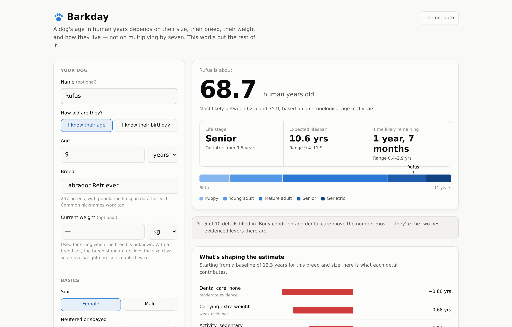

# Barkday

An evidence-based dog age calculator. It works out what your dog's age actually means — using their size, breed, body condition and how they live — instead of multiplying by seven.

**[Try it →](https://natejums.github.io/barkday/)**



---

## Multiplying by seven is wrong

It isn't a rounding error, it's the wrong shape entirely. A one-year-old dog is not a seven-year-old child — it is sexually mature, roughly a fifteen-year-old. And a Great Dane is elderly at seven while a Chihuahua of the same age has years of middle age ahead. One multiplier cannot describe both.

The seven-year rule has no scientific basis. Nobody has ever found the study behind it; the most credible account is that it was a mid-century marketing device to get owners to bring their dogs in annually. The AVMA states plainly that dogs do not age at seven years per year.

## What this does instead

**Four models, all shown.** There is no single accepted conversion formula, so the app runs four and plots them together — because where they disagree is itself the honest answer.

| Model | What it is | Where it fails |
|---|---|---|
| **Barkday estimate** *(headline)* | The size-stratified chart, warped by this dog's own expected lifespan | Inherits the chart's limits; personalisation is capped |
| Veterinary chart | The AKC size-stratified chart, extended past 16 with Metzger/IDEXX | Not genuinely size-stratified below age 6 |
| Epigenetic clock | Wang et al. (2020), from DNA methylation — `16 × ln(age) + 31` | Built on 104 Labradors; no size term; **useless below 1 year**, so it declines to answer there |
| "Times seven" | The folk rule | Wrong at every age, in different directions |

**Aging is progress through a lifespan, not elapsed time.** That is the idea the headline model is built on, borrowed from the reasoning AAHA uses to define life stages. Work out how long *this* dog is expected to live, compare that against a typical dog of the same size, and read their position on the curve accordingly. A dog on track to outlive its size cohort is genuinely younger than the calendar says.

The payoff is that every input reaches the headline number through one principled channel. Body condition, dental care and breed all move expected lifespan, and expected lifespan moves the age. Nothing is bolted on.

It also means the model judges a breed by how long it actually lives rather than by how it looks. A Pug and a Shih Tzu are both flat-faced and both small, but the Shih Tzu lives about three years longer — so at six years old the Pug reads five human years older and the Shih Tzu reads slightly *younger* than the plain chart. A skull-shape penalty would have aged them alike and been wrong about both.

**Modifiers don't add up — and the code refuses to pretend they do.**

This is the part most calculators get wrong. Caloric restriction, body condition, diet quality and exercise are not four independent factors; they are four windows onto largely one causal pathway. "Attentive owner" sits behind dental care, vet visits and parasite compliance alike. Summing the published effects would let a well-cared-for dog claim six or seven bonus years that no study has ever observed.

So the modifiers saturate. Positive and negative adjustments are pooled separately and passed through `tanh`, which stays near-linear for small totals and flattens as they grow. One good habit counts almost fully; the sixth counts for much less. The UI shows both figures — what the factors sum to on paper, and what was actually applied.

## What it models

Beyond age and breed: body condition on the 9-point WSAVA scale, sex, neuter status **and neuter timing**, activity level, diet, dental care, veterinary care, living environment and household smoke exposure. Also the size/lifespan relationship — including the fact that it is **not monotonic**: small dogs slightly outlive toy dogs.

**Neuter timing, done honestly.** Neutered dogs outlive intact ones, so it earns a bonus — but Hart et al. (2020) found that in a number of larger breeds, neutering before the growth plates close raises joint-disorder and some cancer risk. So the neuter factor is timing-aware: a big dog neutered before a year keeps only part of the bonus. Two honesty caveats, both spelled out in the methodology: Hart reported disorder *rates*, not lifespan *years* (so the translation is our own low-confidence derivation, kept a single net-positive factor rather than double-counted as a bonus plus a penalty); and Hart's effect is *breed-specific*, so applying it to all large breeds by size is a deliberate simplification — defensible because the mechanism scales with size, but a reason the figure stays low-confidence and small. Small breeds, where the evidence shows no such effect, are left alone.

**Breed health, made robust.** Every recognised breed gets a health panel that goes well past a list of terms. A catalogue of ~66 well-established conditions — referenced to the Merck Veterinary Manual and the veterinary specialty colleges — enriches each breed's documented predispositions with the signs to watch for, how urgent each is, and what genuinely helps. It is then **personalised to the dog**: concerns are prioritised for the current life stage (developmental problems for a puppy, cancers and cognitive change for a senior, emergencies like bloat at any age), grouped by body system, and cross-referenced against the profile — feeding guidance for a deep-chested breed, airway and heat guidance for a flat face, an anaesthetic-sensitivity flag for sighthounds. It enriches the breed data; it never invents a predisposition, and it is framed as what to raise with a vet, not a diagnosis.

Two things it deliberately does *not* model, and the reasons are the interesting part.

**Brachycephaly.** Flat-faced breeds sit about 1.9 years below the rest of the dataset already, because their breed lifespan figures are observed lifespans and the airway is priced into them. Subtracting a published skull-shape effect on top would charge a Pug twice for one nose. It reaches the answer through the breed's own baseline instead, and shows up as care guidance rather than arithmetic.

**Mixed ancestry — the *bonus*, not the *composition*.** "Mutts are healthier" is the most confidently repeated claim in dog folklore, and the two largest datasets disagree about its sign: Montoya (n = 13.3M) puts mixed breeds at 12.71 years against 12.69 for all dogs — a tie — while McMillan (n = 584,734) has crossbreeds *shorter*-lived at 12.0 against 12.7. Two large studies pointing opposite ways is a reason to model no crossbreed bonus or penalty, not a reason to average them into a number. What the app *does* do is let you enter a known mix — up to three breeds with percentages — and blends their observed size and lifespan baselines and pools their health risks. That uses the composition you supplied; it adds no mutt bonus on top. The two questions are kept separate.

Each factor carries an evidence rating, and the app shows it. A finding from 584,734 dogs and a finding confounded by reverse causation should not look alike, and here they don't.

## Using the engine directly

The calculation code is pure TypeScript with **zero dependencies** and no DOM or clock access. The React app is just one consumer.

```ts
import { calculateDogAge } from './src/core'

const result = calculateDogAge({
  name: 'Rufus',
  ageYears: 9,
  breedName: 'Lab',          // aliases resolve — "Lab", "Alsatian", "Frenchie"
  bodyConditionScore: 7,     // 9-point scale, 4–5 is ideal
  dentalCare: 'none',
  activityLevel: 'sedentary',
})

result.humanAge.years             // 65.3
result.lifeStage.stage            // 'senior'
result.lifespan.expectedYears     // 10.5
result.lifespan.rawDeltaYears     // -1.98  (what the factors sum to)
result.lifespan.appliedDeltaYears // -1.74  (what saturation allowed through)
result.recommendations[0]         // { title: 'Get to an ideal body condition', potentialYears: 0.91, … }
result.breedHealth?.priorityNow   // the concerns to watch for at this dog's age, most urgent first
result.productSuggestions         // generic, brand-free gear tied to the findings above

composeDogReport(result).paragraphs // a warm, personal note about this dog, composed offline
```

Recommendations are not a lookup table. Each one re-runs the whole lifespan model with that single change applied and reports the difference — so the years quoted already account for saturation and for overlap with everything else the dog has going on.

The health report is likewise personalised. `breedHealth.priorityNow` reflects the dog's life stage, `breedHealth.bySystem` groups every documented concern by body system, and `breedHealth.callouts` are the profile-specific cross-references (bloat feeding, flat-faced airway care, and so on). Pass `neuterAgeMonths` to make the neuter factor timing-aware for large breeds.

`productSuggestions` turns those findings into concrete gear that tends to help — a slow-feeder for a bloat-prone breed, a ramp for a long-backed one, a kitchen scale for a dog that needs to lose weight. They are generic *categories* only: **no brands, no links, nothing sponsored.** Naming brands or carrying affiliate links would trade the project's credibility for pennies, and the whole point of this project is the credibility.

`composeDogReport(result)` writes a short, warm note about the dog by name — where it is in life, how it's doing, and tender, specific things to do together at this stage. The point of a life-expectancy figure isn't to start a countdown; it's to help someone make the most of the time they have. The note is **composed in the browser from the structured result** — it is not written by a language model, so it never reaches the network, costs nothing, works offline, and cannot make anything up. Every warm sentence is anchored to a real finding.

## Development

```bash
npm install
npm run dev        # http://localhost:5173
npm test
npm run typecheck
npm run build
```

The test suite covers the models against their published tables, dataset invariants across all 247 breeds, saturation behaviour, life-stage boundary monotonicity, neuter-timing behaviour, the condition catalogue's integrity and match rate, life-stage-aware health prioritisation, and a fuzz pass over every breed at five ages.

## Where the numbers come from

Every constant is traceable, and [`docs/METHODOLOGY.md`](docs/METHODOLOGY.md) lists them with sources and caveats. The main ones:

- **Montoya et al. (2023)** — life expectancy by size band, n = 13,292,929
- **Salt et al. (2019)** — body condition and lifespan, n = 50,787
- **Kealy et al. (2002)**, the Purina Life Span Study — caloric restriction, +1.8 years
- **Wang et al. (2020)** — the DNA-methylation clock
- **AAHA Canine Life Stage Guidelines** — the proportional stage definitions
- **Glickman et al. (2011)** — periodontal disease and kidney disease, n = 164,706
- **Hart et al. (2020)** — age of neutering and joint/cancer risk across 35 breeds, behind the timing-aware neuter factor
- **Merck Veterinary Manual** and the veterinary specialty colleges (ACVS, ACVO, ACVIM) — the clinical reference behind the breed-health condition catalogue

**McMillan et al. (2024)** (n = 584,734) is cited throughout but no number is taken from it. It is the evidence for the two modifiers deliberately left out — skull shape and mixed ancestry — and it earns its place by ruling things out rather than by contributing a constant.

Where a figure is this project's derivation rather than something an author published, the code says so at the point of use and rates it low confidence. The per-point body condition costs are the clearest example: Salt et al. support a binary overweight-vs-ideal comparison, not a continuous dose-response. A calculator needs a slider; the study didn't provide one.

## What this can't tell you

**It is not veterinary advice.** Every number here is a population average pointed at one individual animal, which is a fundamentally lossy operation.

It cannot see your dog. It doesn't know about the murmur, the tumour, the bad hip, or the genetics that matter more than everything on the form combined. Lifestyle factors come from observational data where causation is genuinely tangled — dogs that get walked less may be dogs that are already unwell. The breed lifespan figures are population ranges, and half of all dogs fall outside any given range.

Treat the direction of each effect as solid and the exact figure as an estimate with real uncertainty around it. If something seems wrong with your dog, ask a vet.

## Licence

MIT
